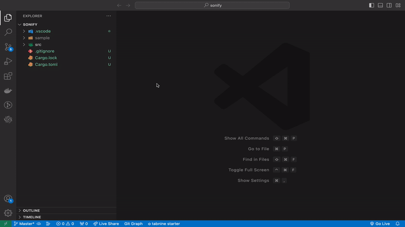

# Neatcoder

Turn your IDE into an AI Software Engineer 🧞‍♂️

Neatcoder enhances VS Code by integrating advanced AI capabilities. It provides you the ability to dynamically scaffold entire codebases from a simple project description. Given that most softwares interact with other softwares, Neatcoder allows you to make its AI aware of external interfaces the software ought to communicate with.

## Features

### Dynamically scaffold entire codebases

1. **Define External Interfaces:** Whether you're dealing with a database, an API, or any other external system, specify it so Neatcoder can integrate it seamlessly into the generated codebase.

2. **Describe Your Project Specification:** Choose a Programming Language, provide a detailed description or specification of your project to let Neatcoder understand its structure, features, and requirements.

**Result:** Once done, Neatcoder not only scaffolds the entire codebase for you but also adds code streaming tasks to the task pool, ensuring you have a head-start in the development phase.

You can also access this feature via `Cmd+Shift+P` and write "Init Codebase".

### Code Streaming

As tasks are added to the task pool, you will be able to run them and the Neatcoder will begin to write the code.

For enhanced productivity you can also stream in the background while you write your own code.

## Features on the roadmap

- Retry logic: Ability to retry tasks if the solution provided is not a suitable one
- DevOps coding tasks: Let Neatcoder assist with common DevOps tasks, setting up CI/CD pipelines, and ensuring a smooth deployment process.
- Embedded Chatting features fully interoperably with the code editor

## Installation

1. Open VS Code.
2. Go to Extensions (or press `Cmd+Shift+X`).
3. Search for "Neatcoder".
4. Click on "Install" to add it to your VS Code.

## Usage

After installation, open the command palette (`Cmd+Shift+P`) and type "Neatcoder" to access its features.

## Feedback and Contributions

Your feedback is invaluable in making Neatcoder even better! Please report any issues or suggestions on our [Neatcoder Issues](https://github.com/neatwork-ai/neatcoder-issues).
