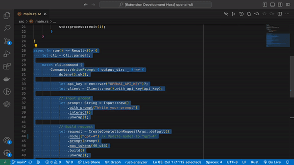
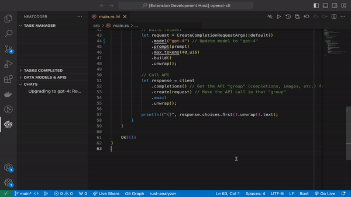
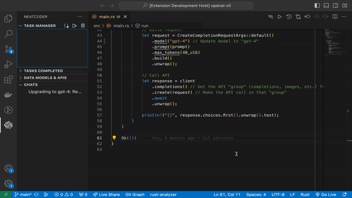

# Neatwork AI

Turn your IDE into an AI Software Engineer with Neatcoder 🧞‍♂️

Neatwork AI enhances VS Code by integrating advanced AI capabilities. It provides you with the ability to dynamically scaffold entire codebases from a simple project description. Given that most software interacts with other software, Neatwork AI allows you to make its AI aware of external interfaces the software ought to communicate with.

## Features

### Chat with ChatGPT natively from VSCode 💥

You can now chat with ChatGPT without leaving VS Code!

With the latest update from Neatwork AI, your VS Code environment just got a lot smarter. We've seamlessly integrated ChatGPT directly into VS Code to keep your development conversations in stride with your coding. This means no more flipping through a maze of chats to find the one you need—your project-specific dialogues are now part of your local workspace, ready when you are.

This sleek integration not only matches your preferred VS Code theme for a visually smooth experience but also enhances how you view and share code within chats, thanks to the improved readability with inline and block code formats.

1. **Start Chatting:**

To start a chat, click `⌘ + ⇧ + P` or (`CTRL + ⇧ + P` in Linux/Windows) and type "New Chat".

2. **Manage your chats:**

You can also manage your chats directly in the side view, as seen below.

2. **Tip: Rearrange  the Chats view:**

If you like to use the file system in your side bar, you can drag your chat list to the file explorer view, as seen below.

3. **On the roadmap**

And we're not stopping there. Get ready for a suite of convenience features that will let you organize, manage, and sift through your chats with ease. Plus, imagine the power of having Code IntelliSense right in your chat, making AI-powered coding suggestions as natural as messaging a friend. With editor and chat interoperability on the horizon, you're looking at a future where your conversations with AI and your code development are one seamless powerhouse workflow. Get ready to chat, code, and create like never before with Neatwork AI.

### Dynamically scaffold entire codebases

1. **Define External Interfaces:**

Whether you're dealing with a database, an API, or any other external system, specify it so Neatcoder can integrate it seamlessly into the generated codebase.

2. **Describe Your Project Specification:**

Choose a programming language and provide a detailed description or specification of your project to let Neatcoder understand its structure, features, and requirements.

**Result:** Once done, Neatcoder not only scaffolds the entire codebase for you but also adds code streaming tasks to the task pool, ensuring you have a head-start in the development phase.

You can also access this feature via `Cmd+Shift+P` and write "Init Codebase".

### Code Streaming

As tasks are added to the task pool, you will be able to run them, and the Neatcoder will begin to write the code.

For enhanced productivity, you can also stream in the background while you write your own code.

## Installation

1. Open VS Code.
2. Go to Extensions (or press `Cmd+Shift+X` in MacOS or `CTRL + Shift + X` on Linux/Windows).
3. Search for "Neatwork AI".
4. Click on "Install" to add it to your VS Code.

## Usage

After installation, open the command palette (`Cmd+Shift+P` on MacOS or `CTRL + Shift + P` on Linux/Windows) and type "Neatcoder" to access its features.

## Feedback and Contributions

Your feedback is invaluable in making Neatcoder even better! Please report any issues or suggestions on our [Neatcoder Issues](https://github.com/neatwork-ai/neatcoder-issues).
